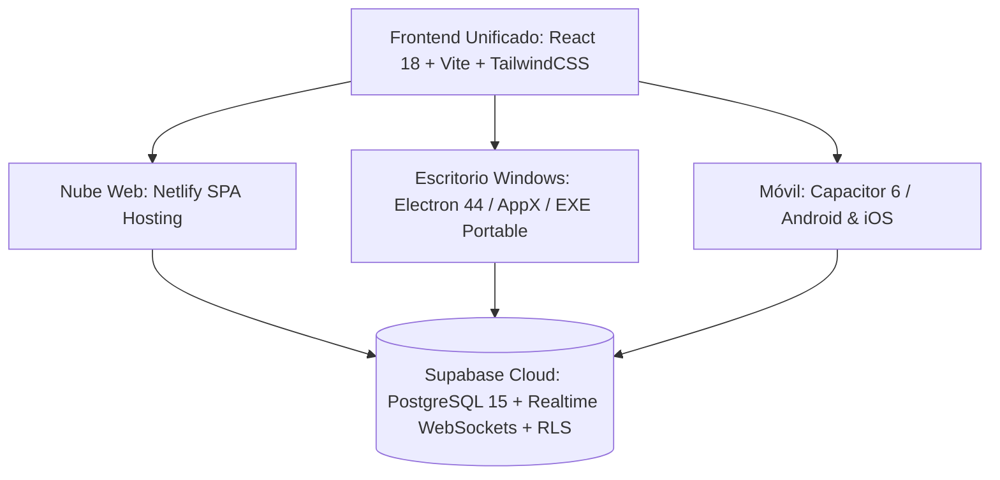

# 📘 KIOSKO — Documentación Técnica, Funcional y de Arquitectura

**Versión del Ecosistema:** `0.1.6`  
**Estado:** Producción Web / Certificación en Microsoft Store / Sincronizado para Android  
**Contacto y Soporte:** `kkiosko440@gmail.com`  
**URL de Producción Web:** [https://administraciondenegocios.netlify.app/](https://administraciondenegocios.netlify.app/)  
**Política de Privacidad:** [https://administraciondenegocios.netlify.app/privacy-policy.html](https://administraciondenegocios.netlify.app/privacy-policy.html)  

---

## 1. 🌟 Resumen Ejecutivo y Propósito

**Kiosko** es una plataforma tecnológica multinegocio de alto rendimiento diseñada para resolver de manera integral la operación, pedidos, inventario comercial y control financiero de dos grandes sectores comerciales:

1. **Sector Gastronómico y de Servicios (Modo Menú y Pedidos)**: Restaurantes, pizzerías, cafeterías, comidas rápidas, barberías y salones de belleza que requieren menú digital, adiciones personalizadas, recepción de pedidos con timbre sonoro en vivo y despacho por estaciones.
2. **Sector Comercial, Bodegas y PyMEs (Modo Solo Inventario)**: Tiendas de abarrotes, distribuidoras, ferreterías, papelerías y misceláneas que requieren control estricto de existencias, cálculo automático de costo promedio ponderado, margen de ganancia comercial (% de utilidad), valuación monetaria total del inventario y ventas rápidas de mostrador.

---

## 2. 🏗️ Arquitectura Tecnológica Multiplataforma

El sistema está construido bajo una arquitectura moderna de código unificado:



### Tecnologías Principales:
* **Frontend Web & UI**: React 18.3, Vite 5.4, TailwindCSS, CSS Variables y diseño responsivo adaptativo con estética oscura (*Dark Luxury / Golden Accent*).
* **Base de Datos y Backend as a Service**: Supabase (PostgreSQL 15), WebSockets en tiempo real (`supabase-js`), Criptografía y *Row Level Security (RLS)*.
* **Escritorio (Windows)**: Electron 44 con servidor HTTP interno para alto aislamiento, empaquetado con `electron-builder` para generar binarios portables (`.exe`) y paquetes de tienda (`.appx`) firmados.
* **Móvil (Android / iOS)**: Capacitor 6 con puente nativo, íconos adaptativos en todas las densidades de pantalla (`mdpi` a `xxxhdpi`) y pantallas de carga (*Splash Screens*).
* **Internacionalización Dinámica**: Soporte multi-idioma instantáneo para **Español (ES) 🇪🇸**, **Inglés (EN) 🇺🇸** y **Português (PT) 🇧🇷**.

---

## 3. 👥 Ecosistema de Roles y Funcionalidades

### 👑 A. Superadministrador (Dueño de la Plataforma)
* **Panel de Control Global**: Vista macro de todos los negocios registrados en la plataforma.
* **Métricas Globales**: Total de ventas acumuladas del mes en la red de negocios, volumen histórico de pedidos y recuento de comercios activos.
* **Interruptor de Operación**: Activación o suspensión inmediata de cualquier comercio con un solo clic.
* **📬 Buzón de Ideas y Sugerencias**:
  * Recepción en tiempo real de sugerencias, solicitudes de nuevas funciones o reportes de errores enviados por los dueños de los negocios.
  * Datos completos del remitente (nombre del negocio, correo, fecha y mensaje).
  * Clasificador de estado del roadmap: **⏳ Pendiente**, **🔍 En revisión**, **📝 Planeada**, **✅ Implementada**.
  * Botón de depuración y eliminación de registros.

---

### 🏪 B. Administrador de Negocio (Dueño del Establecimiento)
* **Onboarding Guiado**:
  * Creación de cuenta con correo y contraseña cifrada.
  * Selector interactivo de Modo de Operación: **🍔 Menú y Pedidos** vs. **📦 Solo Inventario**.
* **Personalización de Marca**: Nombre comercial, actividad, eslogan, logo oficial con imagen o emoji, moneda local.
* **Control de Acceso de Trabajadores**: Generación y regeneración de códigos de vinculación de 6 caracteres únicos por negocio (los empleados ingresan sin necesidad de conocer la contraseña del dueño).
* **Periodo de Prueba y Monetización**:
  * **180 días (6 meses completos)** de prueba gratuita a *Kiosko Pro* con acceso total garantizado.
  * Monitor de días restantes y fecha de renovación.
* **💡 Botón de Feedback Directo**: Modal accesible para proponer mejoras directamente al Superadministrador.

---

### 🧑‍🍳 C. Empleado / Cocina / Despacho
* **Acceso Rápido**: Ingreso con correo personal y vinculación por código del negocio.
* **Tablero Kanban en Tiempo Real**:
  * **Alerta Sonora (Timbre)**: Notificación sonora automática cada vez que un cliente realiza un nuevo pedido.
  * Flujo de estados: `Pendiente` ➔ `En preparación` ➔ `Listo` ➔ `Entregado`.
  * Visualización clara de pedidos a domicilio vs. pedidos en el local.
  * Opciones de edición y cancelación de pedidos con devolución automática de inventario.

---

### 🛍️ D. Cliente (Público / Comensal Web)
* **Cero Fricción**: Acceso web directo sin necesidad de instalar apps ni crear cuentas.
* **Catálogo Visual Interactivo**:
  * Navegación por categorías con fotos en alta definición.
  * Selección de adiciones y extras personalizables (ej. salsas, tocineta, queso).
  * Bloqueo visual automático de productos agotados.
* **Módulo de Entrega**:
  * Selección entre **🍽️ En el local / Para llevar** o **🛵 Domicilio**.
  * Para domicilios: captura obligatoria de Dirección de entrega, Teléfono/WhatsApp y notas de ubicación.
* **Rastreador en Vivo (Tracking)**:
  * Pantalla de seguimiento que actualiza el estado del pedido en tiempo real conforme la cocina lo avanza.

---

## 4. 🧮 Fórmulas Matemáticas y Lógica Contable

El módulo de inventario y finanzas integra cálculos de precisión financiera tipo hoja de cálculo:

### 1. Costo Promedio Ponderado de Compra
Cada compra a proveedores actualiza el costo unitario del inventario ponderando las existencias previas con las nuevas:
$$\text{Costo Promedio Ponderado} = \frac{(\text{Stock Actual} \times \text{Costo Unitario Actual}) + \text{Valor Total de la Nueva Compra}}{\text{Stock Actual} + \text{Cantidad Comprada}}$$

### 2. Margen de Ganancia Comercial
$$\text{Utilidad Bruta por Unidad} = \text{Precio de Venta} - \text{Costo Unitario}$$
$$\text{Margen de Ganancia (\%)} = \left( \frac{\text{Precio de Venta} - \text{Costo Unitario}}{\text{Precio de Venta}} \right) \times 100$$

### 3. Valuación Total del Inventario
$$\text{Valor Total en Dinero Físico} = \sum (\text{Stock de cada artículo} \times \text{Costo Unitario})$$

### 4. Flujo de Caja y Balance Contable Neto
$$\text{Resultado del Periodo} = (\text{Ventas Realizadas} + \text{Ingresos Extra}) - (\text{Compras a Proveedores} + \text{Nómina Pagada} + \text{Gastos Varios})$$

---

## 5. 🗄️ Esquema de Base de Datos (Supabase / PostgreSQL)

| Tabla | Propósito |
| :--- | :--- |
| `negocios` | Datos principales, modo de operación (`catalogo` o `inventario`), logo, slogan y estado. |
| `perfiles` | Usuarios autenticados, roles (`superadmin`, `admin`, `empleado`, `pendiente`) y negocio asignado. |
| `negocio_codigos` | Código único alfanumérico de 6 caracteres para vincular trabajadores. |
| `categorias` | Agrupadores del menú gastronómico o de servicios. |
| `productos` | Artículos del menú con precio, foto, stock, disponibilidad y adiciones. |
| `ingredientes` | Inventario de materias primas o mercancía de bodega (stock, mínimo, costo, precio venta). |
| `compras` | Registro de compras a proveedores que aumentan existencias y egresos. |
| `pedidos` | Órdenes de clientes con total, estado, tipo de entrega (`local`/`domicilio`), dirección y teléfono. |
| `pedido_items` | Detalle de productos, adiciones y observaciones por pedido. |
| `ventas` | Registro contable de cada pedido despachado o venta directa de inventario. |
| `trabajadores` | Plantilla de colaboradores con cargo y asignación salarial mensual. |
| `pagos` | Comprobantes de nómina emitidos a trabajadores. |
| `ingresos` / `egresos` | Movimientos manuales de flujo de caja y gastos operativos. |
| `sugerencias` | Buzón de feedback de los negocios dirigido al Superadministrador. |

---

## 6. 📱 Certificaciones y Despliegue en Tiendas

### 🪟 Microsoft Store (Windows Partner Center)
* **Product ID**: `9NSSBH34P6NP`
* **Identidad de Publicación**: `Qelvis.Kiosko` (CN: `CN=F23D3FDE-C721-4D89-931F-3F58AFAE6618`)
* **Mosaicos Visuales (Norma 10.1.1.11)**: Iconos y mosaicos adaptativos en alta resolución (`StoreLogo`, `Square44x44`, `Square71x71`, `Square150x150`, `LargeTile`, `Wide310x150`, `SplashScreen`).
* **Política de Privacidad**: Alojada públicamente en `https://administraciondenegocios.netlify.app/privacy-policy.html`.
* **Paquete de Producción**: `release/Kiosko 0.1.6.appx`.

### 🤖 Android (Google Play / APK)
* **Package ID**: `com.fogon.app` (Capacitor Android).
* **Recursos**: Íconos adaptativos mipmap (`mdpi` a `xxxhdpi`) y pantallas de inicio configuradas en `android/app/src/main/res/`.

---

## 7. 📁 Estructura del Código Fuente

```text
Kiosko/
├── android/                 # Proyecto nativo Android (Capacitor / Gradle)
├── build/                   # Recursos de empaquetado para Windows (icon.ico, appx tiles)
├── electron/                # Backend de Electron (main.js, servidor local, handlers)
├── public/                  # Archivos estáticos públicos (_redirects, privacy-policy.html, favicons)
├── release/                 # Instaladores compilados (.appx para Store, .exe para escritorio)
├── src/
│   ├── components/          # Vistas modulares y componentes de UI
│   │   ├── AdminTabs.jsx    # Pestañas de gestión (Dashboard, Productos, Inventario, Pedidos, Finanzas)
│   │   ├── AdminView.jsx    # Marco de navegación del Administrador
│   │   ├── Auth.jsx         # Formularios de autenticación y creación de negocios
│   │   ├── ClienteView.jsx  # Carrito, selector de domicilios y tracking del cliente
│   │   ├── EmpleadoView.jsx # Tablero kanban para cocina/despacho
│   │   ├── FeedbackModal.jsx# Modal de sugerencias para dueños
│   │   ├── PrivacyModal.jsx # Modal visual de política de privacidad dentro de la app
│   │   ├── SuperadminView.jsx# Panel maestro con métricas y buzón de ideas
│   │   └── ui.jsx           # Componentes base (Botones, Modales, Tablas, StatCards, Pills)
│   ├── lib/                 # Capa lógica, API y utilidades
│   │   ├── api.js           # Servicios y consultas directas a Supabase
│   │   ├── auth.js          # Manejo de sesiones, roles y códigos
│   │   ├── helpers.js       # Formateadores de moneda, fechas y sonidos
│   │   ├── i18n.jsx         # Motor de internacionalización (ES, EN, PT)
│   │   ├── inventory.js     # Fórmulas de costos, márgenes y valuación
│   │   ├── orderSales.js    # Lógica de conversión de pedidos a ventas
│   │   ├── subscription.js  # Cálculo de días de prueba (180 días)
│   │   └── supabaseClient.js# Cliente oficial de conexión Supabase
│   ├── App.jsx              # Enrutador principal y layout general
│   └── index.css            # Estilos globales y TailwindCSS
├── supabase/                # Scripts SQL de migraciones (v1 a v16)
├── netlify.toml             # Configuración de despliegue en Netlify
└── package.json             # Dependencias, scripts de compilación y metadata
```

